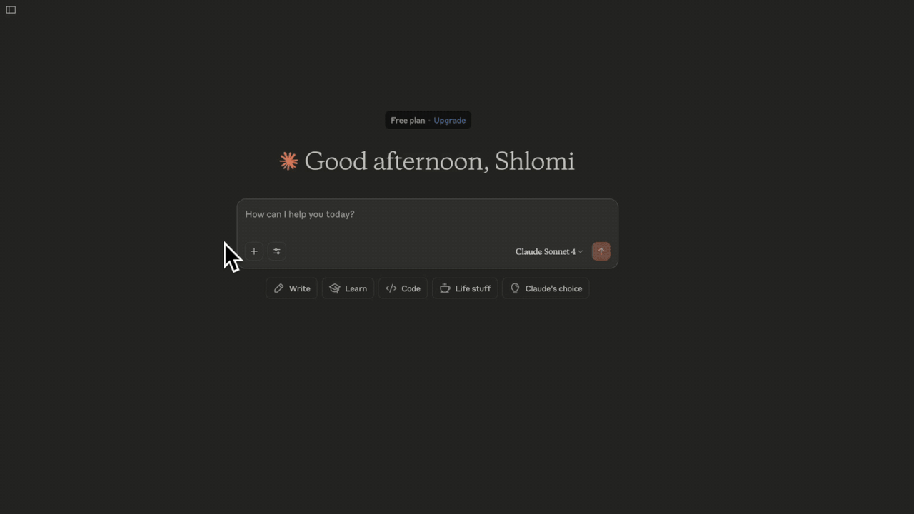

# Asher - Personal Financial Data MCP Server

> **Get closer to your own data, on steroids!**

A secure, local-first financial data aggregator for Israeli banks and credit card companies, built with TypeScript and powered by [israeli-bank-scrapers](https://github.com/eshaham/israeli-bank-scrapers). Asher helps you aggregate and analyze your financial transactions across multiple sources while keeping your data private and secure.
Information is scraped and stored in a local, encrypted SQLite database.



## Features

- **MCP Server**: Implements the Model Context Protocol for easy integration with MCP Hosts (e.g. Claude)
- **Extensive Integration**: Supports all Israeli banks and credit card companies provided by [israeli-bank-scrapers](https://github.com/eshaham/israeli-bank-scrapers).
- **Local-First**: Your financial data never leaves your machine
- **Encryption**: Sensitive data is encrypted at rest
- **CLI**: Easy setup and management via command line
- **TypeScript**: Built with type safety in mind

## Prerequisites

- Node.js 18+
- npm

## Installation

1. Clone the repository:
   ```bash
   git clone https://github.com/shlomiuziel/asher-mcp.git
   cd asher-mcp
   ```

2. Install dependencies:
   ```bash
   npm install
   ```

3. Build the project:
   ```bash
   npm run build
   ```

4. **Optional**: Install the system wide `asher` cli command:
   ```bash
   npm install -g .
   ```

## Database Location

The database file is stored in the following location, depending on your OS:

- **macOS:** `~/Library/Application Support/Asher/database.db`
- **Linux:** `~/.local/share/Asher/database.db`
- **Windows:** `%APPDATA%/Asher/database.db`

## First Run & Configuration

1. Prepare a `credentials.json` file with your provider credentials.
   See supported providers and credential fields [here](https://github.com/eshaham/israeli-bank-scrapers/blob/master/src/definitions.ts).

2. Ingest your credentials:
   ```bash
   asher ingest-creds -f credentials.json
   ```
   - Use this command to update credentials as needed. Deletion can be done manually (see the `scraper_credentials` table).
   - You will be prompted to enter an encryption key for your database (for first-time setup, you'll re-enter to confirm).

3. During setup, you will be prompted to:
   - Enable notifications (a test notification will help with permissions)
   - Optionally perform the first scrape (recommended to avoid latency and possible timeouts due to the large amount of data)
   - Configure Claude Desktop integration (can be directly launched with `npm run configure:claude`)

## Usage

### MCP Tools

Asher provides several tools for MCP hosts:

- `fetchTransactions`: Fetch recent transactions and store them in the database.
- `describeTable`: Get detailed information about a table (columns, indexes).
- `listTables`: List all tables in the database.
- `getTableSchema`: Get the schema for a specific table.
- `sqlQuery`: Execute a safe SELECT query on allowed tables (prevents SQL injection and unauthorized access).
- `fetch-last-month-transactions`: Fetch and summarize last month's transactions and expenses.

A sample prompt is included to help you generate a detailed monthly report.

#### Test your MCP server

You can run the MCP Inspector for local testing:

```bash
npm run start:mcp:inspector
```

## Security

- All sensitive data is encrypted at rest.
- Bank credentials are stored securely inside the database using your encryption key.
- The application follows the principle of least privilege (`chmod 600` on the database file).
- The encryption key is requested at runtime and never stored on disk.

## Testing

Run all tests:

```bash
npm test
```

## License

This project is licensed under the MIT License. See the [LICENSE](LICENSE) file for details.

## ⚠️ Important Disclaimer

**PLEASE READ THIS DISCLAIMER CAREFULLY BEFORE USING THIS SOFTWARE.**

This software is designed to help you analyze your financial data and make it accessible to MCP hosts. However, by using this software, you acknowledge and agree to the following:

1. **No Warranty**: This software is provided "as is," without warranty of any kind, express or implied, including but not limited to the warranties of merchantability, fitness for a particular purpose, and noninfringement.

2. **Financial Data Security**:
   - You are solely responsible for the security of your banking credentials and financial data
   - Never share your credentials or encryption keys with anyone
   - The developers are not responsible for any unauthorized access to your financial accounts

3. **Use at Your Own Risk**:
   - The developers are not responsible for any financial losses, data loss, or other damages resulting from the use of this software
   - Always verify important financial information through official bank channels
   - The software may not be compatible with all banking institutions

4. **No Liability**: In no event shall the authors or copyright holders be liable for any claim, damages, or other liability, whether in an action of contract, tort, or otherwise, arising from, out of, or in connection with the software or the use or other dealings in the software.

5. **Third-Party Services**: This software may integrate with third-party services. The developers are not responsible for the actions, content, or policies of these third parties.

By using this software, you acknowledge that you have read this disclaimer and agree to be bound by its terms.


